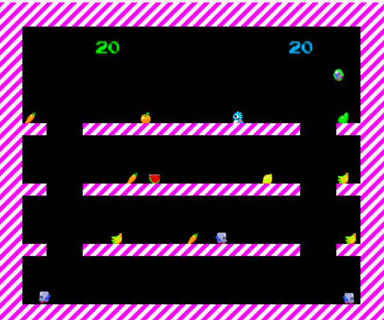

# Bubble Dragons

**Bubble Dragons** is a small 2D game inspired by the classic *Bubble Bobble*, recreated in Python.  
This project is a lightweight reinterpretation featuring two playable levels, simple game mechanics, and retro-style gameplay.

The goal is to trap enemies in bubbles and eliminate them, just like in the original arcade game.  
It was developed for educational and nostalgic purposes, and serves as a base for further game development or Python game design practice.

Built using Python and Pygame.

This project also uses **g2d** and **actor.py** by *tomamic*, which are included under a free copyright license.  
These libraries helped with game graphics and actor management.

---

## Gameplay Screenshot



---

## How to Play

To download and play the game, follow these steps:

1. **Clone the repository:**

   ```bash
   git clone https://github.com/sasyxk/bubble-dragons.git
   cd bubble-dragons
   

2. **Install Python:**

    If you don't have Python installed, download it here:
    https://www.python.org/downloads/

3. **Install dependencies:**

    This project uses Pygame. You can install it via pip:
    ```bash
    pip install pygame
    

4. **Run the game:**

    Launch the game by running:
    ```bash
    python BounceGui.py
    
## Controls

### Green Dragon:
- Move: ← → (left and right arrow keys)  
- Jump: ↑ (up arrow)  
- Shoot: Space

### Blue Dragon:
- Move: A, D  
- Jump: W  
- Shoot: C

---

Have fun playing! Feel free to contribute or open issues if you find bugs or want to suggest improvements.
